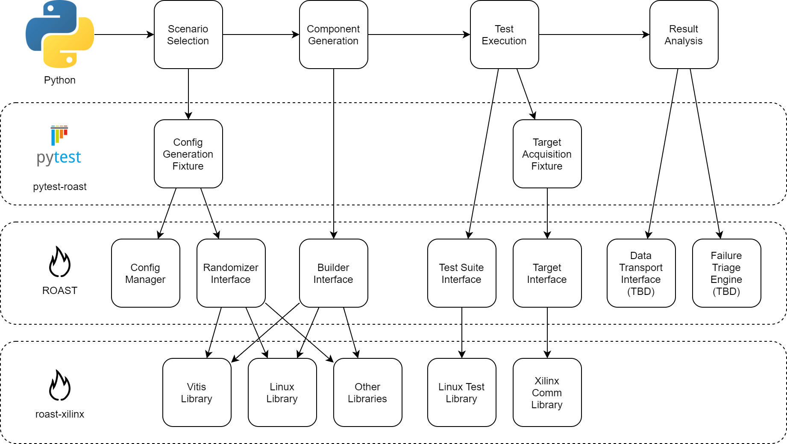

# ROAST
ROAST is an open-source Python framework that simplifies the development of complex validation test suites. To accomplish this, ROAST provides a collection of interfaces that allows test developers to build
test suites in a highly structured manner.

Key features:

- Compose systems from Xilinx or custom components
- Define systems composed from various configuration sources
- Heirarchical configuration system
- Randomized data provider for randomized testing
- Generic APIs for simplified usage and access
- Plugin system for extensibility

ROAST consists of three packages:

- roast: Core functionality that includes interfaces, plugin framework, configuration
  management, and more
- roast-xilinx (recommended: plugin for roast that includes Xilinx specific functionality such as
  board acquisition, PetaLinux building, Vitis wrapper, and more.
- pytest-roast (optional): plugin for pytest that includes pytest fixtures for accelerated test
  development when using pytest as a test runner. Features includes target automation, scenario
  generation, and configuration generation.

Example test flow with package breakdown:

