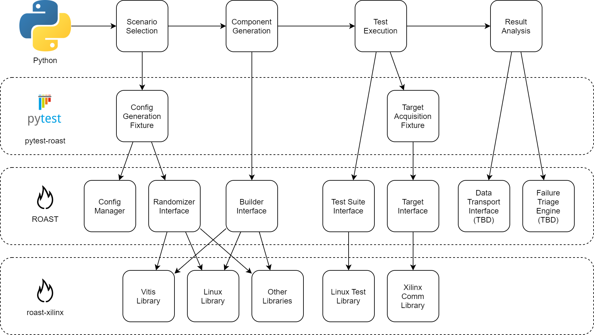

ROAST features
==============

ROAST provides a rich feature set to assist developer in accelerating test development in areas
of the test flow.

ROAST consists of three packages:

- **roast**: Core functionality that includes high-level interfaces, plugin framework, configuration
  management, and more
- **roast-xilinx (recommended)**: plugin for roast that includes Xilinx specific functionality such as
  board acquisition, PetaLinux building, Vitis wrapper, and more.
- **pytest-roast (optional)**: plugin for pytest that includes pytest fixtures for accelerated test
  development when using pytest as a test runner. Features includes board automation, scenario
  generation, and configuration generation.

Example test flow with package breakdown:

Define systems composed from various configuration sources
----------------------------------------------------------

System properties can be defined in multiple file formats through the ROAST configuration
management system. This allows for maximum flexibility where some configuration parameters may
have been generated from another tool or users are more familiar with a particular format.

Learn more about the :doc:`configuration`.

Compose systems from Xilinx or custom components
------------------------------------------------

A full range of Xilinx component libraries are available in the ``roast-xilinx`` package. These
include:

- PetaLinux
- Linux
- Xilinx Software Command-Line Tool (XSCT)
- Xilinx System Debugger (XSDB)
- JTAG, Linux boot
- ATF
- U-Boot
- SD
- AIE
- Cross-Compile
- CMake

Custom components can be created and registered within the ``roast`` namespace.

Learn more about :doc:`advanced/component_models` and :doc:`advanced/component_plugins`.

Configuration can be specified or command line overridden
---------------------------------------------------------

Configuration values can have interpolation expressions that allows parameters to be dynamically
changed. The replacement values can be established in another configuration file or through the
command line. This provides test repositories a way to signifcantly scale with unlimited test
variants.

Learn more about :ref:`String Interpolation <configuration:Template-Based (Heirarchical)>`,
:doc:`complex_structures` and :doc:`pytest_fixtures`.

Generate data for randomized testing
------------------------------------

ROAST includes a data provider (randomization engine) to expand coverage in tests beyond static
values. A database of parameters and possible values can be established where randomized values
can be generated. Constraints (excluded values and range limits) can be defined to shape
returned values.

The provider includes various methods to generate randomized data and to add custom randomization
algorithms.

Learn more about the :doc:`provider`.